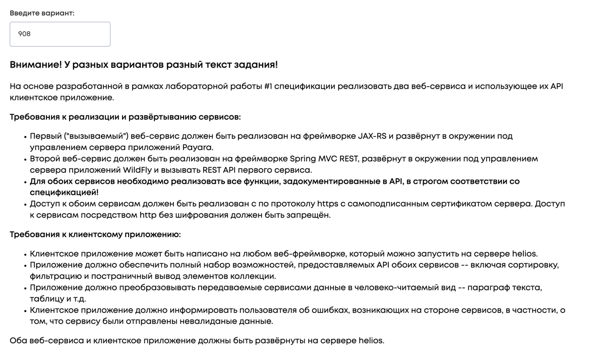

# Лабораторная № 1. Вариант 67105

## Задание

Внимание! У разных вариантов разный текст задания!

Разработать спецификацию в формате OpenAPI для набора веб-сервисов, реализующего следующую функциональность:

Первый веб-сервис должен осуществлять управление коллекцией объектов. В коллекции необходимо хранить объекты класса Movie, описание которого приведено ниже:

```java
public class Movie {                                                                                                                                                                                           
    private Integer id; //Поле не может быть null, Значение поля должно быть больше 0, Значение этого поля должно быть уникальным, Значение этого поля должно генерироваться автоматически
    private String name; //Поле не может быть null, Строка не может быть пустой                                                                                                                                
    private Coordinates coordinates; //Поле не может быть null                                                                                                                                                 
    private java.time.ZonedDateTime creationDate; //Поле не может быть null, Значение этого поля должно генерироваться автоматически                                                                           
    private long oscarsCount; //Значение поля должно быть больше 0                                                                                                                                             
    private Integer budget; //Значение поля должно быть больше 0, Поле может быть null                                                                                                                         
    private MovieGenre genre; //Поле не может быть null                                                                                                                                                        
    private MpaaRating mpaaRating; //Поле не может быть null                                                                                                                                                   
    private Person screenwriter;                                                                                                                                                                               
}

public class Coordinates {                                                                                                                                                                                     
    private Double x; //Значение поля должно быть больше -130, Поле не может быть null                                                                                                                         
    private Double y; //Максимальное значение поля: 388, Поле не может быть null                                                                                                                               
}

public class Person {
    private String name; //Поле не может быть null, Строка не может быть пустой                                                                                                                                
    private double height; //Значение поля должно быть больше 0                                                                                                                                                
    private Color eyeColor; //Поле не может быть null                                                                                                                                                          
    private Color hairColor; //Поле может быть null                                                                                                                                                            
    private Country nationality; //Поле не может быть null                                                                                                                                                     
    private Location location; //Поле не может быть null                                                                                                                                                       
}

public class Location {                                                                                                                                                                                        
    private Float x; //Поле не может быть null                                                                                                                                                                 
    private int y;                                                                                                                                                                                             
    private Long z; //Поле не может быть null                                                                                                                                                                  
}

public enum MovieGenre {                                                                                                                                                                                       
    WESTERN,                                                                                                                                                                                                   
    ADVENTURE,                                                                                                                                                                                                 
    TRAGEDY,                                                                                                                                                                                                   
    SCIENCE_FICTION;                                                                                                                                                                                           
}

public enum MpaaRating {                                                                                                                                                                                       
    G,                                                                                                                                                                                                         
    PG,                                                                                                                                                                                                        
    PG_13,                                                                                                                                                                                                     
    R,                                                                                                                                                                                                         
    NC_17;                                                                                                                                                                                                     
}

public enum Color {                                                                                                                                                                                            
    GREEN,                                                                                                                                                                                                     
    RED,                                                                                                                                                                                                       
    BLUE,                                                                                                                                                                                                      
    YELLOW,                                                                                                                                                                                                    
    BROWN;                                                                                                                                                                                                     
}

public enum Color {                                                                                                                                                                                            
    GREEN,                                                                                                                                                                                                     
    RED,                                                                                                                                                                                                       
    BLACK,                                                                                                                                                                                                     
    YELLOW,                                                                                                                                                                                                    
    ORANGE;                                                                                                                                                                                                    
}

public enum Country {                                                                                                                                                                                          
    UNITED_KINGDOM,                                                                                                                                                                                            
    SOUTH_KOREA,                                                                                                                                                                                               
    JAPAN;                                                                                                                                                                                                     
}
```                                                                                                                                                                                               
Веб-сервис должен удовлетворять следующим требованиям:

- API, реализуемый сервисом, должен соответствовать рекомендациям подхода RESTful.
- Необходимо реализовать следующий базовый набор операций с объектами коллекции: добавление нового элемента, получение элемента по ИД, обновление элемента, удаление элемента, получение массива элементов.      
- Операция, выполняемая над объектом коллекции, должна определяться методом HTTP-запроса.                                                                                                                        
- Операция получения массива элементов должна поддерживать возможность сортировки и фильтрации по любой комбинации полей класса, а также возможность постраничного вывода результатов выборки с указанием размера и порядкового номера выводимой страницы.
- Все параметры, необходимые для выполнения операции, должны передаваться в URL запроса.
- Информация об объектах коллекции должна передаваться в формате json.
- В случае передачи сервису данных, нарушающих заданные на уровне класса ограничения целостности, сервис должен возвращать код ответа http, соответствующий произошедшей ошибке.

Помимо базового набора, веб-сервис должен поддерживать следующие операции над объектами коллекции:

- Удалить все объекты, значение поля mpaaRating которого эквивалентно заданному.
- Удалить один (любой) объект, значение поля screenwriter которого эквивалентно заданному.
- Рассчитать среднее значение поля budget для всех объектов.

Эти операции должны размещаться на отдельных URL.

Второй веб-сервис должен располагаться на URL /oscar, и реализовывать ряд дополнительных операций, связанных с вызовом API первого сервиса:

- /movies/reward-r : добавить всем фильмам категории "R" по одному "Оскару"
- /directors/humiliate-by-genre/{genre} : отобрать все "Оскары" у всех фильмов режиссёров, снявших хоть один фильм в указанном жанре

Эти операции также должны размещаться на отдельных URL.

Для разработанной спецификации необходимо сгенерировать интерактивную веб-документацию с помощью Swagger UI. Документация должна содержать описание всех REST API обоих сервисов с текстовым описанием функциональности каждой операции.

# Лабораторная №2. Вариант 908

## Задание
На основе разработанной в рамках лабораторной работы #1 спецификации реализовать два веб-сервиса и использующее их API клиентское приложение.

Требования к реализации и развёртыванию сервисов:

Первый ("вызываемый") веб-сервис должен быть реализован на фреймворке JAX-RS и развёрнут в окружении под управлением сервера приложений Payara.
Второй веб-сервис должен быть реализован на фреймворке Spring MVC REST, развёрнут в окружении под управлением сервера приложений WildFly и вызывать REST API первого сервиса.
Для обоих сервисов необходимо реализовать все функции, задокументированные в API, в строгом соответствии со спецификацией!
Доступ к обоим сервисам должен быть реализован с по протоколу https с самоподписанным сертификатом сервера. Доступ к сервисам посредством http без шифрования должен быть запрещён.
Требования к клиентскому приложению:

Клиентское приложение может быть написано на любом веб-фреймворке, который можно запустить на сервере helios.
Приложение должно обеспечить полный набор возможностей, предоставляемых API обоих сервисов -- включая сортировку, фильтрацию и постраничный вывод элементов коллекции.
Приложение должно преобразовывать передаваемые сервисами данные в человеко-читаемый вид -- параграф текста, таблицу и т.д.
Клиентское приложение должно информировать пользователя об ошибках, возникающих на стороне сервисов, в частности, о том, что сервису были отправлены невалиданые данные.

